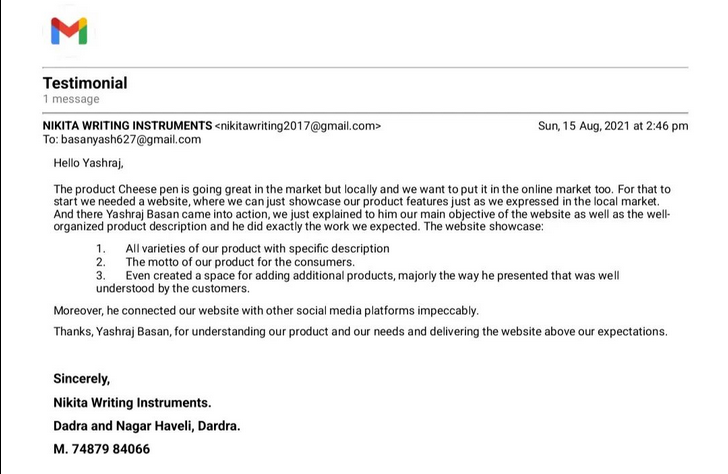

## The Challenge

When Cheespens, a burgeoning pen brand, approached me, they had a clear vision - to establish a strong online presence that would build trust among investors and clients. They needed a simple static website showcasing their product lineup, a prominent Google ranking for "cheese pens," and a cost-effective solution.

## The Solution

Keeping practicality and affordability in mind, I decided to go with Gatsby.js, to build a website that was not just functional but dynamic. Markdown made content management a breeze, putting the power in Cheespens' hands to update their product catalog effortlessly. To keep costs down, we decided to embrace GitHub Pages, a choice that helped us sidestep the hefty expenses often tied to traditional CMS platforms.

## The Results

**Cost Efficiency**: Cheespens made a smart move by setting aside around 2000 rupees for their domain. But the real money-saving trick was when I suggested using GitHub Pages. This choice saved them a lot of money compared to traditional CMS hosting, leading to big annual savings.

**Simplified Content Management**: The markdown integration provided Cheespens with an intuitive solution for updating their website, enabling them to expand their product range without the worry of escalating hosting expenses.

**SEO Triumph**: Basic SEO enhancements, including content optimization and meta tag improvements, propelled "cheese pens" to the top of Google search results, with **cheesepens** leading the way.

**Enhanced Brand Trust**: The newly created website, with a focus on professional design, instilled trust among investors and clients, enhancing Cheespens' credibility.

**Social Media Expansion**: I provided advice to Cheespens, encouraging them to establish a presence on social media platforms. This initiative expanded their customer reach and engagement, ultimately leading to increased brand recognition. Additionally, I integrated their website with social media platforms for seamless interaction with their audience.

## Testimonial

This case study underscores the significance of practical, cost-effective solutions.
