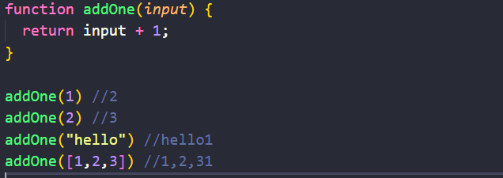

This function is a valid React component because it accepts a single “props” (which stands for properties) object argument with data and returns a React element. We call such components “function components” because they are literally JavaScript functions.

